# markadd — Expanded Development Plan (with UML & Sequence Diagrams)

This document outlines the **phased roadmap** for developing **markadd**, including architectural diagrams, class interactions, and sequence flows.  
Each phase builds incrementally on the previous ones, converging toward a safe, extensible Markdown automation CLI/TUI inspired by Obsidian’s QuickAdd.


## Phase 0 — Repo Bootstrap & CI Setup

**Objective:** Establish a clean, multi-crate Rust workspace, ready for modular development, testing, and CI integration.

**Description:**  
We initialise the repository as a Cargo workspace with three crates (`core`, `cli`, and a stub `tui`) and integrate CI pipelines for linting, testing, and formatting.  
A dummy `markadd doctor` command will print version and build metadata to confirm a functioning binary and workspace structure.

**Deliverables:**
- Crate layout (`core`, `cli`, `tui`)
- GitHub Actions workflow (fmt, clippy, test)
- Basic CLI skeleton (`markadd doctor`)
- Documentation: `CONTRIBUTING.md`, coding style guide

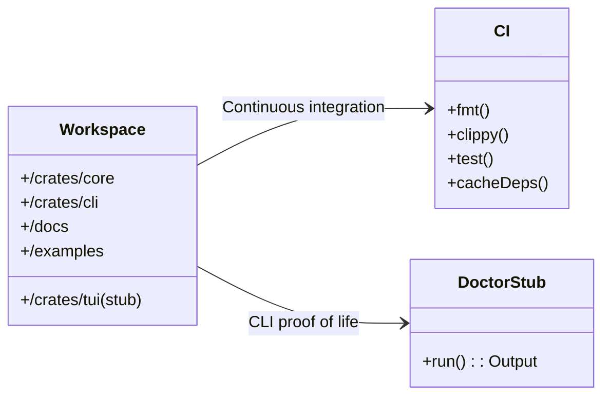

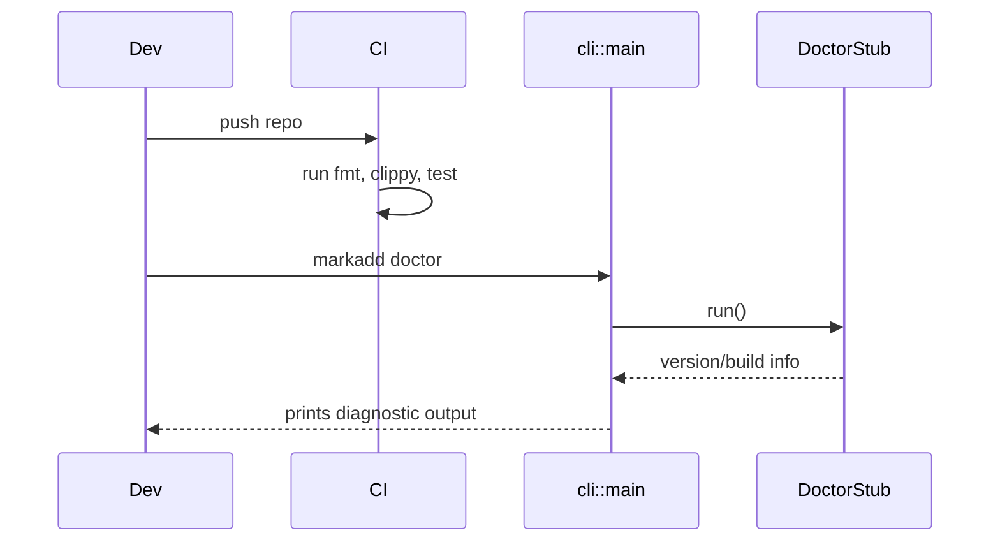


## Phase 1 — Config Loader (TOML) & Doctor Command

**Objective:** Implement deterministic configuration loading from `~/.config/markadd/config.toml`, ensuring profiles, directories, and security settings are validated.

**Description:**  
This phase introduces the `ConfigLoader`, which parses the ground-truth TOML file, validates directory paths, and expands `~`.  
The `doctor` command is extended to provide detailed feedback on active profiles and configuration validity.

**Deliverables:**
- Config schema (version, profiles, security)
- TOML parser and validator
- `ResolvedConfig` struct
- Updated `doctor` command printing loaded profile info

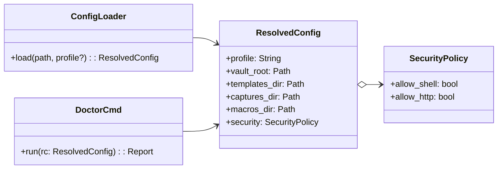

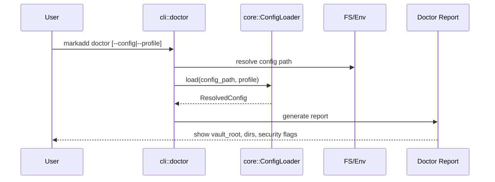


## Phase 2 — YAML/Markdown Content Parsers

**Objective:** Implement robust parsers for the three content types: **templates**, **captures**, and **macros**.

**Description:**  
Templates are Markdown files with YAML front-matter defining variables and output policies.  
Captures and macros are YAML-only and describe insertions and multi-step workflows respectively.  
Parsing must be strict: fail early for malformed fields and report human-readable errors.

**Deliverables:**
- Parsers for `.md` (front-matter split) and `.yaml`
- Strong typing for variable and target definitions
- Error spans with file/line feedback
- `markadd list` command listing available items

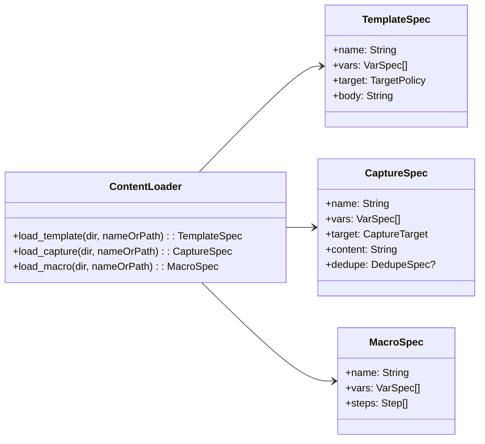

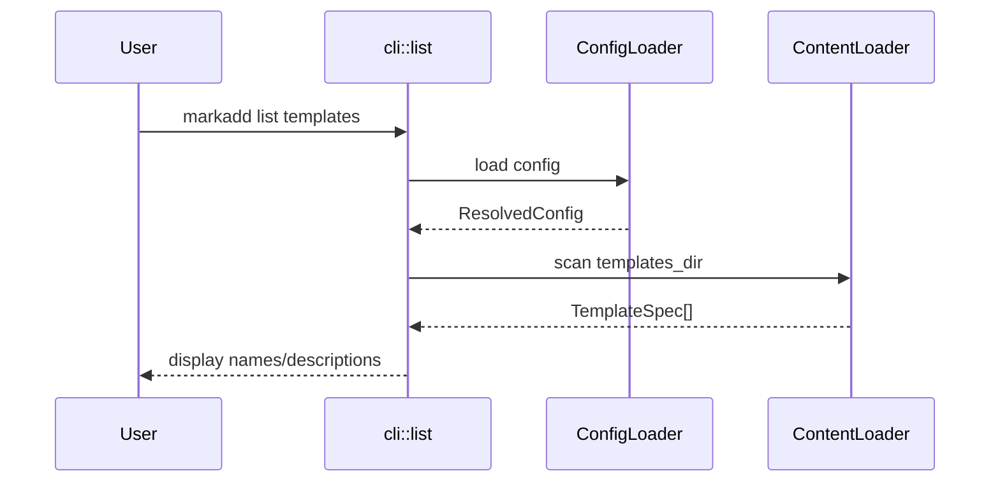


## Phase 3 — Variable Resolution & Template Engine (Tera)

**Objective:** Introduce variable providers, merging logic, and templating for rendering paths and content.

**Description:**  
Variable resolution merges values from multiple layers: auto providers (now, uuid, git branch), defaults from YAML, CLI arguments, and interactive prompts.  
We integrate **Tera** for safe, familiar Jinja-like rendering with filters like `date` and `slugify`.  
The `preview` command is introduced for dry-run rendering.

**Deliverables:**
- `Resolver` module with layered precedence
- Core providers (`Time`, `UUID`, `Git`, `Env`)
- Integration with Tera
- `markadd preview` command

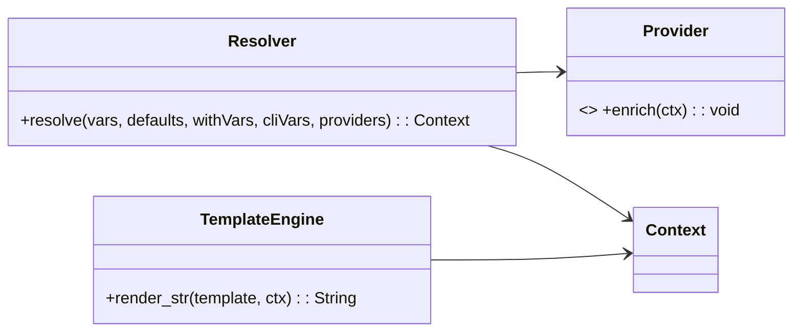

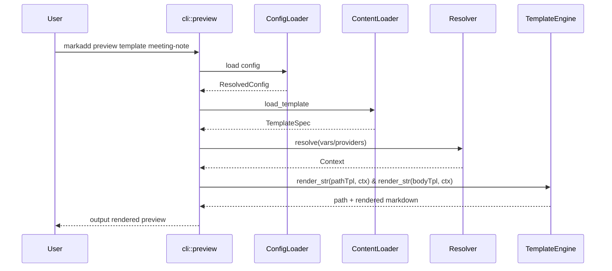


## Phase 4 — Markdown AST Insertions (Comrak)

**Objective:** Implement AST-based insertion at section boundaries, eliminating fragile regex manipulations.

**Description:**  
We use **Comrak** to parse Markdown into an AST and insert new fragments safely at the beginning or end of specific sections.  
This ensures syntax preservation even in complex documents.

**Deliverables:**
- AST insertion logic
- Section-finding utilities
- Golden tests for edge cases

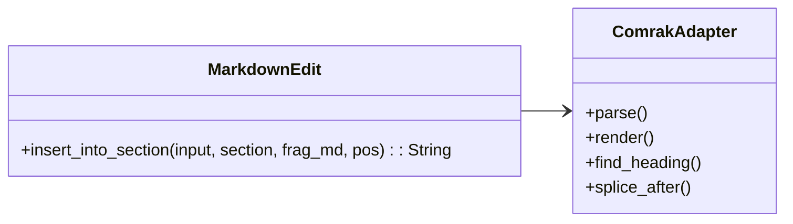

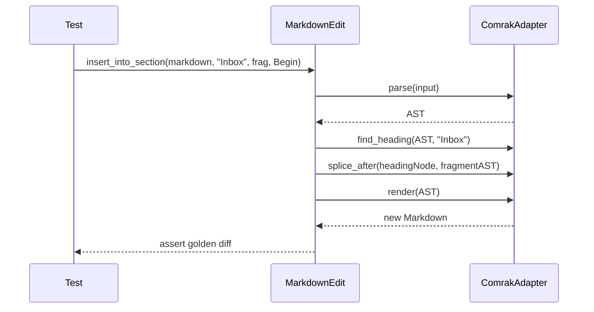


## Phase 5 — File Planner & Atomic Writes

**Objective:** Ensure safe disk writes and enable undo functionality.

**Description:**  
This phase handles file mutations through a transaction-like mechanism using temporary files, atomic renames, and fsync.  
Every change is logged to a JSONL file for recovery and auditability.

**Deliverables:**
- `FilePlan` abstraction (Create/Edit)
- Atomic write executor
- Operation log with undo support

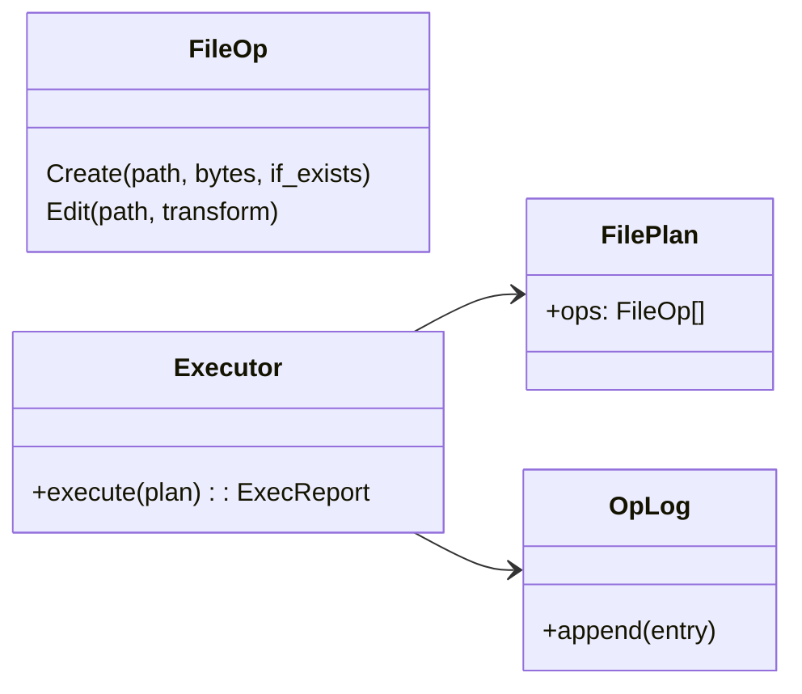

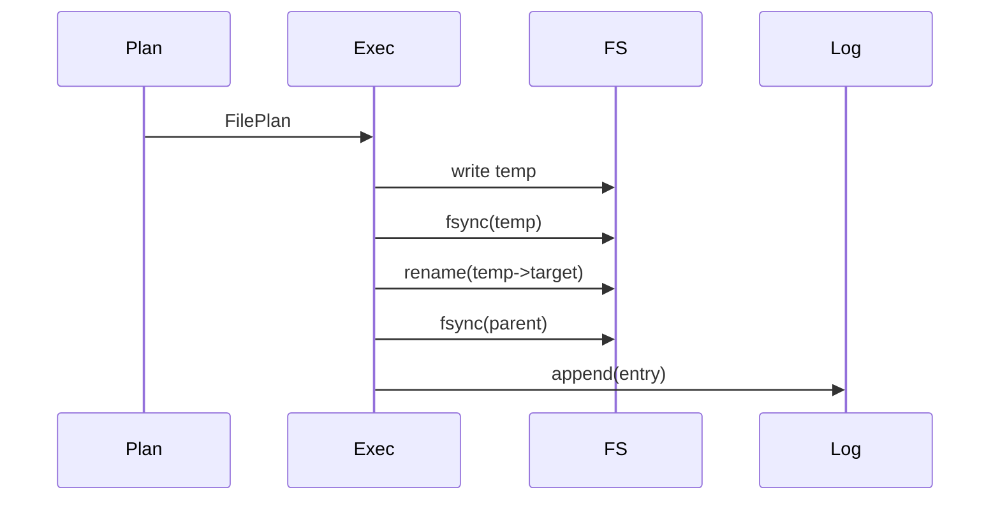


## Phase 6 — Minimal CLI

**Objective:** Deliver a working CLI exposing all key commands: `template`, `capture`, `macro`, and utilities.

**Description:**  
The CLI acts as a lightweight coordinator calling the pure `core` modules.  
It supports structured (`--json`) and human-readable output modes, and will handle global options like `--dry-run` and `--trust`.

**Deliverables:**
- `Coordinator` facade in CLI
- Subcommands: template, capture, macro, list, preview, doctor, undo
- Error taxonomy

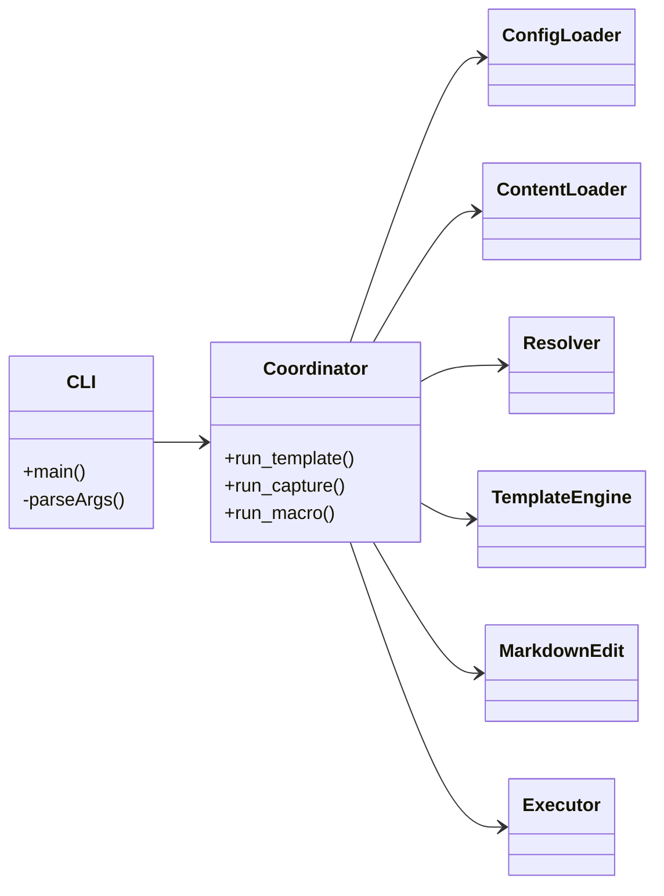

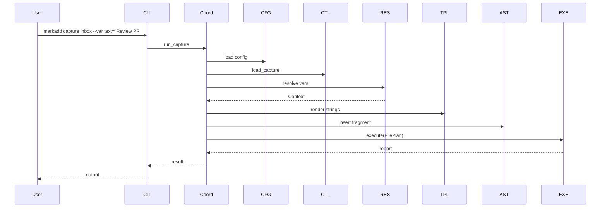


## Phase 7 — Macro Runner & Security Gates

**Objective:** Enable multi-step workflows and enforce trust-based access for shell/network operations.

**Description:**  
The macro runner executes a series of actions, maintaining a shared context and respecting per-step policies (abort/continue).  
The security module ensures no untrusted code (e.g. shell) executes without explicit `--trust`.

**Deliverables:**
- Macro runner
- Security gate system
- Shell execution layer with sanitised commands

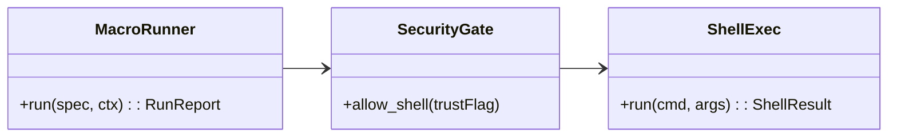

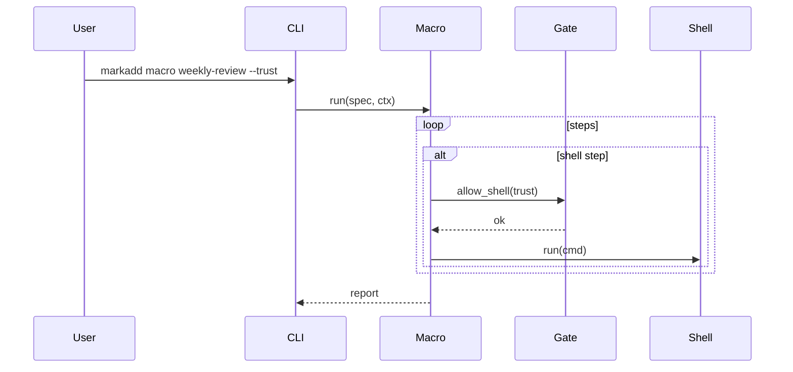


## Phase 8 — Lua Hook Integration (Optional)

**Objective:** Provide a scripting escape hatch for advanced templating and macros.

**Description:**  
Expose a minimal, sandboxed Lua API (via `mlua`) to script dynamic captures and macros.  
Restrict IO and system calls, enforce instruction/time limits, and integrate with the same trust model.

**Deliverables:**
- Safe `LuaEngine`
- `api.*` bindings (render, template, capture, now, uuid)
- Trust enforcement (`--trust` + config flags)
- `markadd eval-lua` for debugging

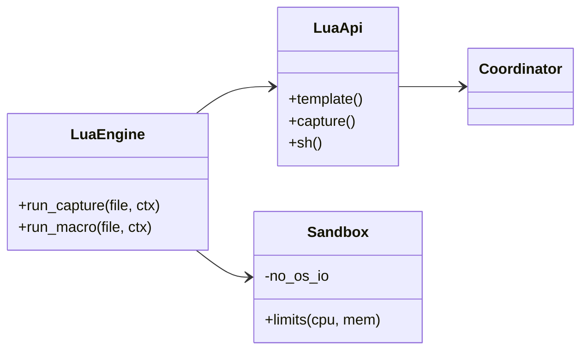

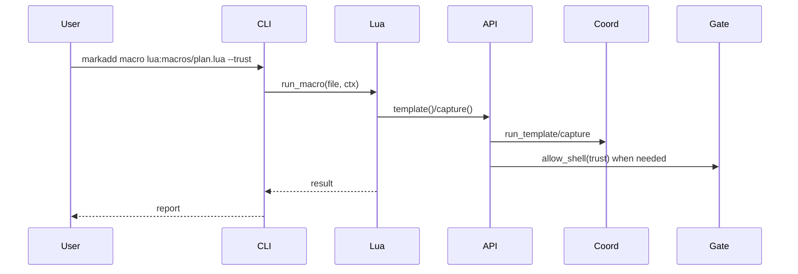


## Phase 9 — TUI Palette (Optional)

**Objective:** Offer a terminal UI for interactive note creation, with fuzzy search and live previews.

**Description:**  
A TUI built with Ratatui or Iocraft exposes a palette where users can select templates or macros, fill variables, preview rendered output, and confirm execution—all without leaving the terminal.

**Deliverables:**
- Palette UI
- Preview pane with live rendering
- Input prompts for variables
- `doctor` and `list` accessible in TUI

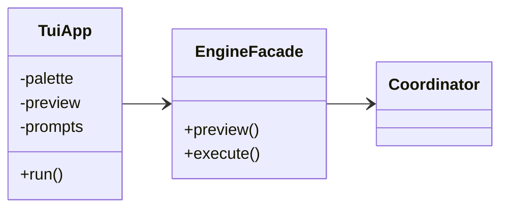

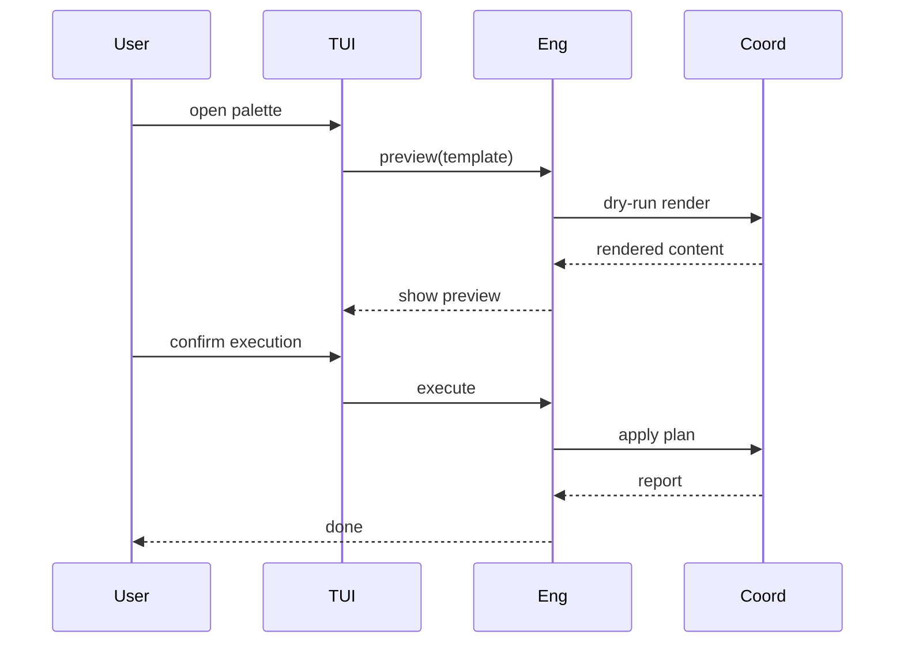


## Phase 10 — Documentation, Packaging, and Release

**Objective:** Finalise documentation, distribute binaries, and ensure reproducibility.

**Description:**  
Document every command and authoring guideline, provide installation instructions (Cargo and Homebrew), and include `doctor`-based diagnostics for user self-support.

**Deliverables:**
- Markdown documentation under `docs/`
- User and developer guides
- Homebrew formula and Cargo packaging
- Automated builds in CI

```mermaid
classDiagram
  direction LR
  class Docs {
    +UserGuide()
    +TemplateAuthoring()
    +SecurityModel()
  }
  class Release {
    +build()
    +publish()
  }

  Docs ..> CLI
  Release ..> CI
```

```mermaid
sequenceDiagram
  participant Maintainer
  participant CI
  participant Release
  participant Users

  Maintainer->>CI: tag v0.1.0
  CI->>Release: build + sign binaries
  Release-->>Users: publish (brew/cargo)
  Maintainer-->>Users: announce + docs update
```


## Final Notes

- Each phase ends with a **usable subset** of markadd (buildable, testable).
- The system stays modular; each module is unit-testable in isolation.
- Security defaults are conservative—nothing runs shell code without explicit consent.
- YAML and TOML remain human-first formats.
- Lua scripting is opt-in and sandboxed.

After **Phase 5**, the system already provides a functional QuickAdd alternative for the terminal.  
Phases 7–9 progressively extend it into a flexible, scriptable, and interactive knowledge-capture tool.

