# markadd — Expanded Development Plan (with UML & Sequence Diagrams)

This document outlines the **phased roadmap** for developing **markadd**, including architectural diagrams
, class interactions, and sequence flows.  
Each phase builds incrementally on the previous ones, converging toward a safe, extensible Markdown
automation CLI/TUI inspired by Obsidian’s QuickAdd.

# markadd — Development Plan with Descriptions, Deliverables, Diagrams, and Folder Snapshots

This roadmap details each phase with: a short **Goal**, a **Description** of scope and constraints, explicit **Deliverables**, a **UML class diagram**, a **sequence diagram** of supported/tested flows, and a **filesystem snapshot** expected at the end of the phase.

Note: tree views are illustrative; some files (e.g., Cargo.lock) omitted for clarity.

## Phase 0 — Repo Bootstrap & CI

**Goal**  
Establish a clean multi-crate workspace, CI pipeline, and a compiling “doctor” stub to validate toolchain and wiring.

**Description**  
Create a Cargo workspace with `core`, `cli`, and a stub `tui`. Add GitHub Actions for fmt, clippy, and tests. Provide a minimal `doctor` command that prints build/version info. Define coding conventions and contribution guidelines.

**Deliverables**  
- Cargo workspace with crates: `core`, `cli`, `tui` (stub)  
- CI workflow (fmt, clippy, test)  
- `markadd doctor` stub  
- CONTRIBUTING and basic README

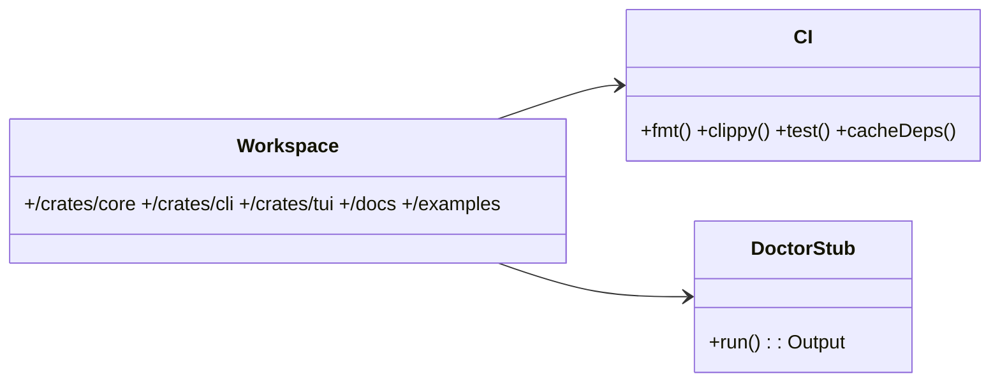

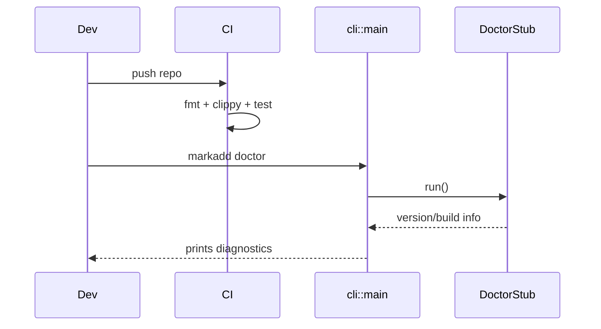

Filesystem snapshot
```
markadd/
├─ Cargo.toml
├─ .github/workflows/ci.yml
├─ README.md
├─ CONTRIBUTING.md
├─ crates/
│  ├─ core/  
│  │  ├─ Cargo.toml  
│  │  └─ src/lib.rs
│  ├─ cli/   
│  │  ├─ Cargo.toml  
│  │  └─ src/main.rs
│  └─ tui/   
│     ├─ Cargo.toml  
│     └─ src/main.rs
├─ docs/DEVELOPMENT.md
└─ examples/.gitkeep
```

## Phase 1 — Config Loader (TOML) & Doctor

**Goal**  
Load and validate the ground-truth `~/.config/markadd/config.toml`, resolve the active profile, expand paths, and report via `doctor`.

**Description**  
Implement `ConfigLoader` with schema v1. Ensure deterministic precedence for `--config` and `--profile`. Validate directories and security flags. Extend `doctor` to show resolved state and actionable errors.

**Deliverables**  
- `ResolvedConfig` and `SecurityPolicy` types  
- Loader with `~` expansion and absolute path normalisation  
- Detailed `doctor` output and error taxonomy  
- Unit tests for config edge cases

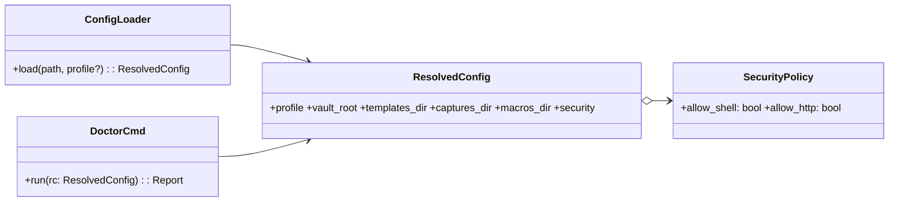

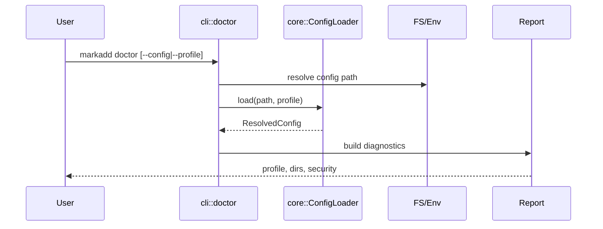

Filesystem snapshot
```
markadd/
├─ crates/core/src/config/
│  ├─ loader.rs
│  └─ types.rs
├─ crates/core/tests/config_tests.rs
└─ crates/cli/src/cmd/doctor.rs
```

## Phase 2 — Content Parsers (YAML/MD)

**Goal**  
Parse Template (MD+front-matter), Capture (YAML), and Macro (YAML) with strict validation and friendly errors. Provide `list`.

**Description**  
Implement a `ContentLoader` that reads templates with YAML front-matter (vars, target policy) and YAML files for captures/macros. Reject unknown keys. `list` enumerates valid items with names/paths.

**Deliverables**  
- `TemplateSpec`, `CaptureSpec`, `MacroSpec` types  
- Front-matter splitter for `.md` templates  
- Strict serde_yaml parsers and error messages with file/line  
- `markadd list` command and tests

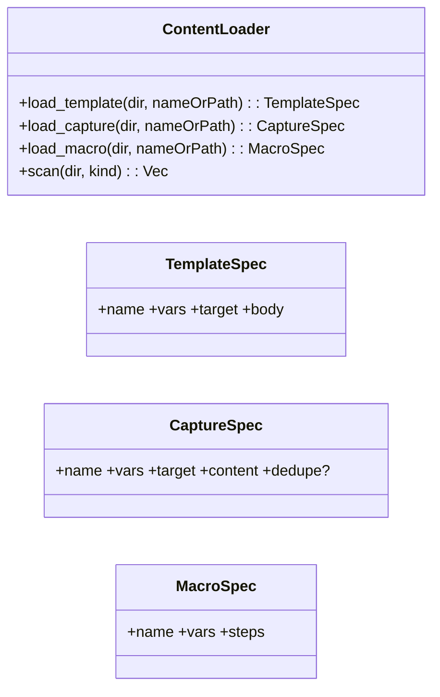

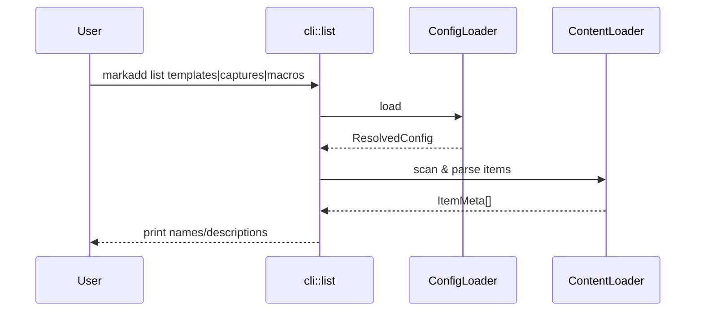

Filesystem snapshot
```
markadd/
├─ crates/core/src/content/
│  ├─ loader.rs
│  ├─ template.rs
│  ├─ capture.rs
│  ├─ macro.rs
│  └─ errors.rs
├─ crates/cli/src/cmd/list.rs
└─ examples/.markadd/{templates,captures,macros}/...
```

## Phase 3 — Variable Resolution & Tera Rendering

**Goal**  
Deterministically resolve variables from providers/defaults/CLI and render both output paths and Markdown bodies. Provide `preview`.

**Description**  
Add `Resolver` with precedence: providers → YAML defaults → `with:` → CLI `--var` → prompt (UI). Integrate Tera and custom filters. Implement `preview` to render without writing.

**Deliverables**  
- `Resolver`, `Provider` trait, and core providers (time, uuid, git, env)  
- Tera engine with helpers (date, slugify, sha1)  
- `markadd preview` command  
- Tests for validation and rendering

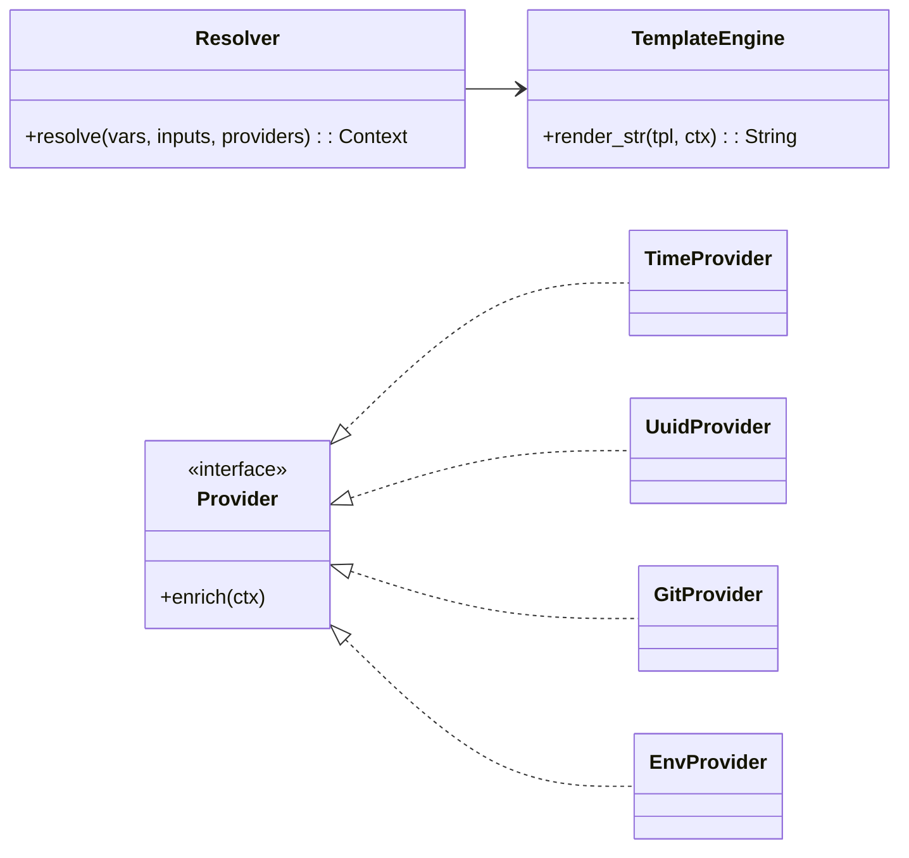

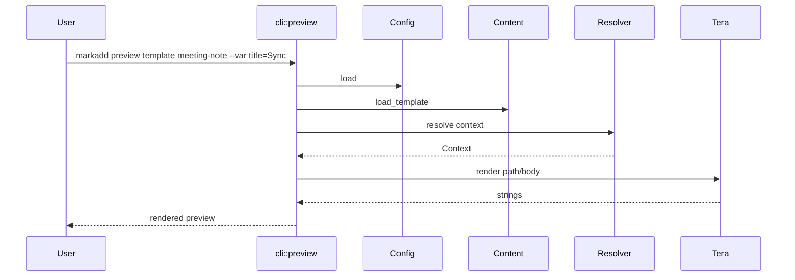

Filesystem snapshot
```
markadd/
├─ crates/core/src/vars/
│  ├─ resolver.rs
│  ├─ provider.rs
│  ├─ providers/{time.rs,uuid.rs,git.rs,env.rs}
│  └─ types.rs
├─ crates/core/src/template/tera_engine.rs
└─ crates/cli/src/cmd/preview.rs
```

## Phase 4 — Markdown AST Insertions (Comrak)

**Goal**  
Insert Markdown fragments at the beginning or end of a named section using an AST, not regex.

**Description**  
Wrap Comrak to parse, find headings, compute section bounds, splice fragment, and render back. Golden tests cover tricky documents (code fences, tables, last section).

**Deliverables**  
- `MarkdownEdit` trait with Comrak implementation  
- Section navigation helpers  
- Golden tests and fixtures

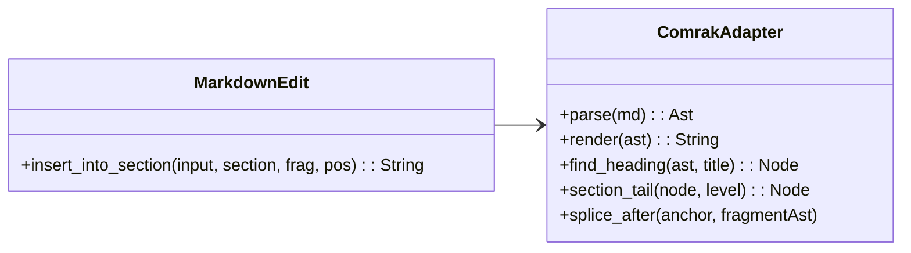

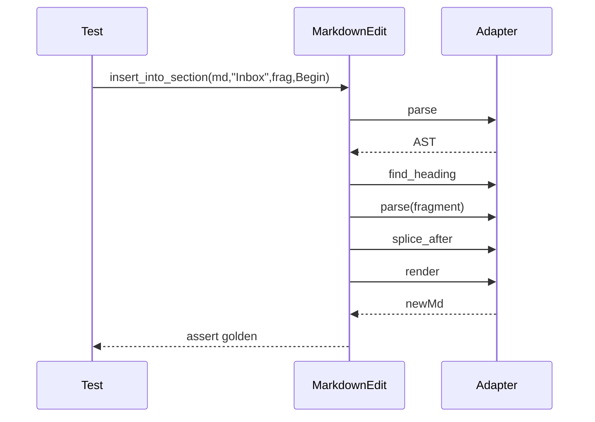

Filesystem snapshot
```
markadd/
├─ crates/core/src/markdown_ast/
│  ├─ mod.rs
│  ├─ comrak.rs
│  └─ tests/{insert_tests.rs,golden_*}
└─ docs/CAPTURE.md
```

## Phase 5 — File Planner, Atomic Writes, Undo Log

**Goal**  
Guarantee safe writes using temp+rename+fsync and record a JSONL operation log enabling undo.

**Description**  
Define `FilePlan` for Create/Edit with pure transforms. Implement atomic executor with per-op logging and basic undo that restores pre-change content where possible.

**Deliverables**  
- `FilePlan`, `FileOp`, `Transform`, executor  
- JSONL op log and `undo` scaffolding  
- Crash-safety tests

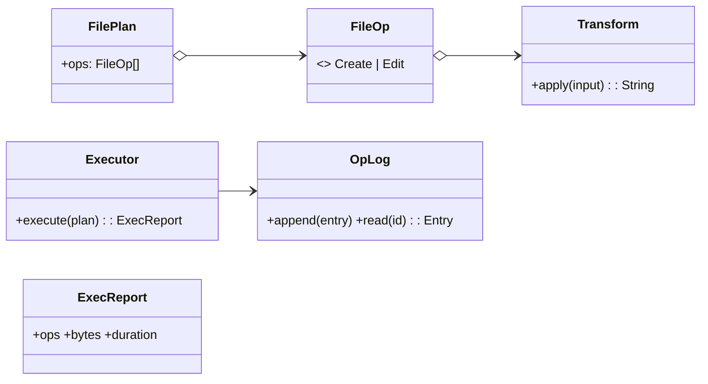

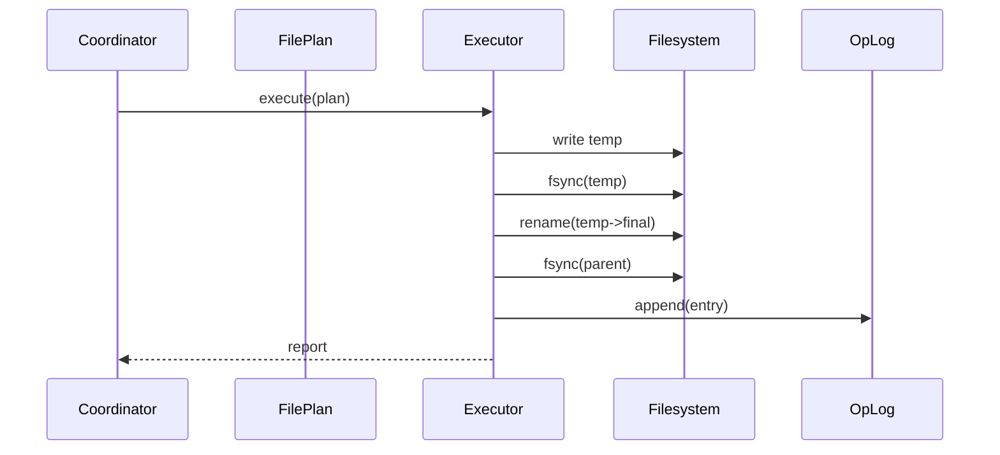

Filesystem snapshot
```
markadd/
├─ crates/core/src/planner/
│  ├─ plan.rs
│  ├─ exec.rs
│  ├─ oplog.rs
│  └─ tests/atomic_tests.rs
└─ docs/WRITES.md
```

## Phase 6 — Minimal CLI Wiring

**Goal**  
Expose working commands: `template`, `capture`, `macro`, `list`, `preview`, `doctor`, `undo` with human/JSON output.

**Description**  
Introduce a `Coordinator` facade in the CLI that wires config, content, vars, template engine, AST, and planner. Keep CLI thin; errors are categorised and surfaced cleanly.

**Deliverables**  
- CLI subcommands with shared options (`--config`, `--profile`, `--var`, `--dry-run`, `--json`, `--trust`)  
- Integration tests for template/capture end-to-end  
- Stable JSON report structs

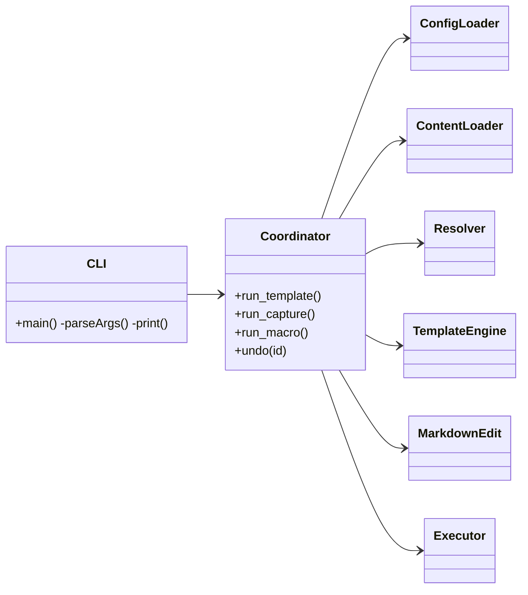


Filesystem snapshot
```
markadd/
├─ crates/cli/src/
│  ├─ main.rs
│  └─ cmd/
│     ├─ doctor.rs
│     ├─ list.rs
│     ├─ preview.rs
│     ├─ template.rs
│     ├─ capture.rs
│     ├─ macro.rs
│     └─ undo.rs
└─ docs/CLI.md
```

## Phase 7 — Macro Runner & Security Gates

**Goal**  
Support multi-step workflows with shared context and enforce trust for shell (and, later, HTTP).

**Description**  
Implement `MacroRunner` executing steps sequentially, merging `with:` into the shared context. Gate shell actions via `SecurityGate` requiring config permission and `--trust`. Provide clear per-step logs and error policies.

**Deliverables**  
- Macro runner with `abort`/`continue` error handling  
- Security gate and safe shell execution wrapper  
- Integration tests covering trust and failure modes

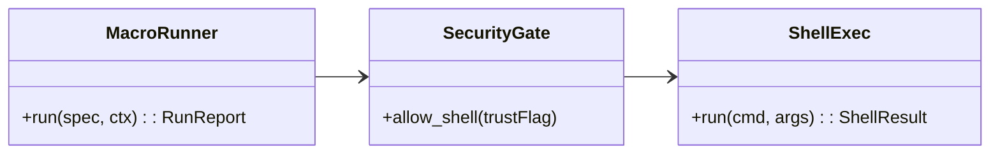

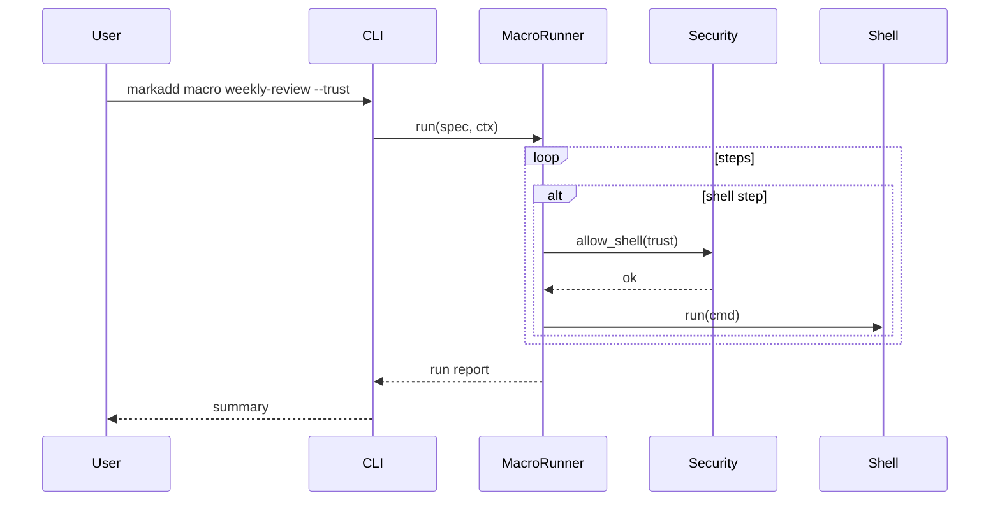

Filesystem snapshot
```
markadd/
├─ crates/core/src/macro/
│  ├─ runner.rs
│  └─ types.rs
├─ crates/core/src/security/
│  ├─ gate.rs
│  └─ shell.rs
└─ tests/integration_macro.rs
```

## Phase 8 — Lua Hooks (Optional)

**Goal**  
Offer a sandboxed scripting escape hatch for programmable captures/macros, without compromising safety or determinism.

**Description**  
Embed Lua via `mlua` in safe mode. Expose a tiny API to call template/capture actions and pure helpers. Disallow OS/IO by default; shell and network remain gated and require `--trust`. Provide an evaluator for CI/dry runs.

**Deliverables**  
- `LuaEngine` with `api` bindings and sandbox  
- `markadd eval-lua` command  
- Tests for sandbox limits and trust gates

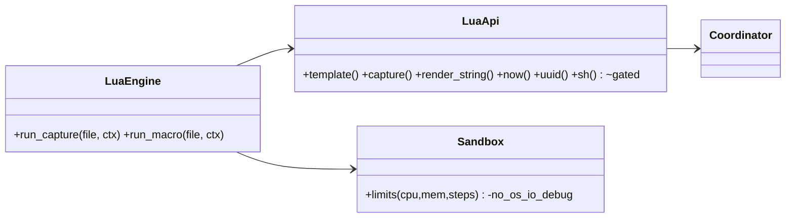

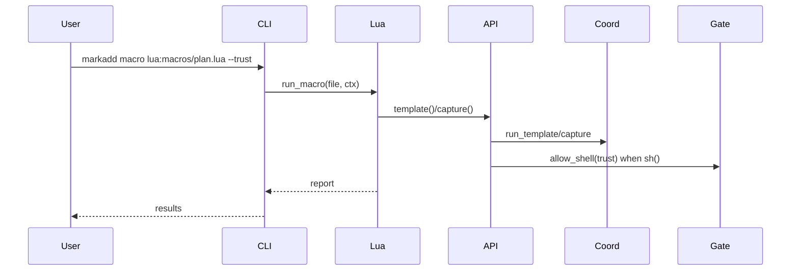

Filesystem snapshot
```
markadd/
├─ crates/core/src/lua/
│  ├─ engine.rs
│  ├─ api.rs
│  └─ sandbox.rs
└─ examples/.markadd/macros/plan.lua
```

## Phase 9 — TUI Palette (Optional)

**Goal**  
Provide an interactive palette with fuzzy search, live previews, typed prompts, and one-keystroke execution.

**Description**  
Build a Ratatui/Iocraft TUI that lists templates/captures/macros, previews the rendered output or diff, and collects variables interactively. The TUI delegates all work to the same core coordinator.

**Deliverables**  
- TUI app with palette, preview, prompts  
- Non-blocking engine calls; cancellable prompts  
- Snapshot tests for screens

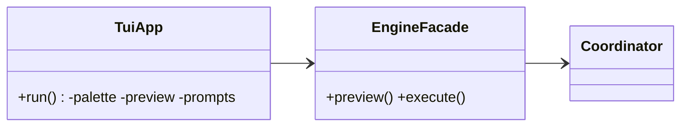

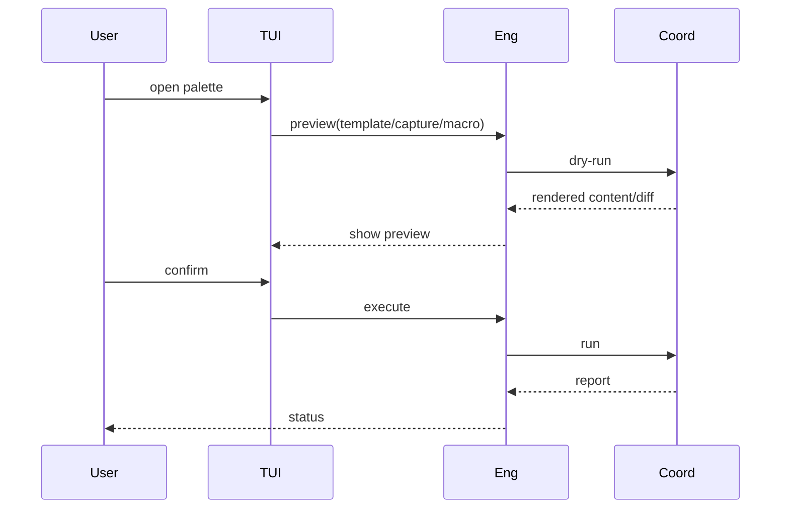

Filesystem snapshot
```
markadd/
├─ crates/tui/src/
│  ├─ main.rs
│  ├─ app.rs
│  ├─ palette.rs
│  ├─ preview.rs
│  └─ prompts.rs
└─ assets/theme.toml
```

## Phase 10 — Documentation, Packaging, Release

**Goal**  
Publish binaries and comprehensive docs; ensure reproducible builds and a friendly onboarding experience.

**Description**  
Write user and authoring guides, security and CLI references. Automate release builds for macOS/Linux. Provide Homebrew tap and `cargo install` paths. Keep `doctor` guidance up to date for self-service troubleshooting.

**Deliverables**  
- Docs: CONFIG, TEMPLATES, CAPTURE, MACROS, SECURITY, CLI  
- Release CI with signed artifacts  
- Homebrew formula and crate publication  
- Changelog and versioning policy

```mermaid
classDiagram
  direction LR
  class Docs { +UserGuide +Authoring +Security +CLIRef }
  class Release { +build() +sign() +publish() }
  Docs ..> CLI
  Release ..> CI
```

```mermaid
sequenceDiagram
  participant Maintainer
  participant CI
  participant Release
  participant Users
  Maintainer->>CI: tag v0.1.0
  CI->>Release: build artifacts
  Release-->>Users: brew/cargo availability
  Maintainer-->>Users: docs site update
```

Filesystem snapshot
```
markadd/
├─ .github/workflows/release.yml
├─ docs/
│  ├─ README.md
│  ├─ CONFIG.md
│  ├─ TEMPLATES.md
│  ├─ CAPTURE.md
│  ├─ MACROS.md
│  ├─ SECURITY.md
│  └─ CLI.md
├─ dist/               # CI artifacts
└─ Formula/markadd.rb  # Homebrew tap (optional)
```


