# markadd — Development Plan (with UML & Sequence Diagrams)

This document details the phased development plan for **markadd**, including per-phase architecture snapshots:
1) a **UML/class diagram** of key types/modules and their relationships, and  
2) a **sequence diagram** for the flows implemented and tested in that phase.

> Legend: these diagrams are intentionally minimal to reflect the scope of each phase. Names stabilise as we progress.


---

## Phase 0 — Repo bootstrap

**Goals:** Workspace scaffolding, CI, versioning, and an initial `doctor` stub.

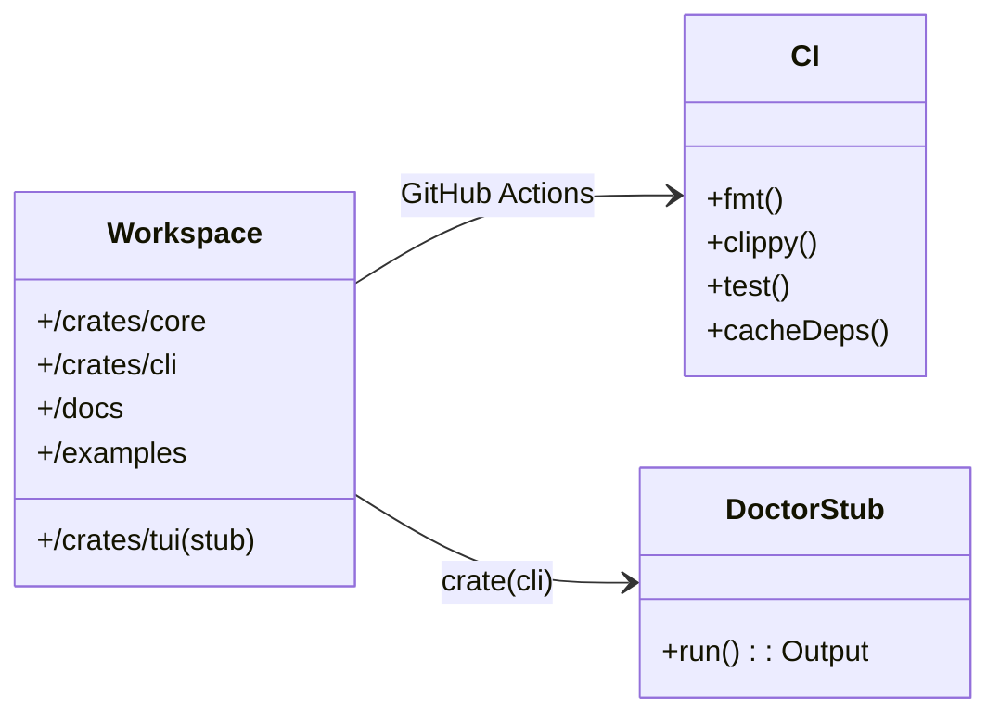

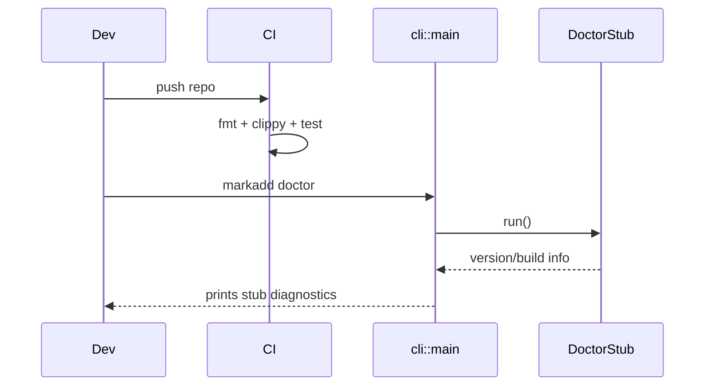

**Deliverables:** Workspace compiles; CI green; `markadd doctor` prints version/build info.


---

## Phase 1 — Config loader (TOML) + doctor

**Goals:** Deterministic config via `~/.config/markadd/config.toml` and clear diagnostics.

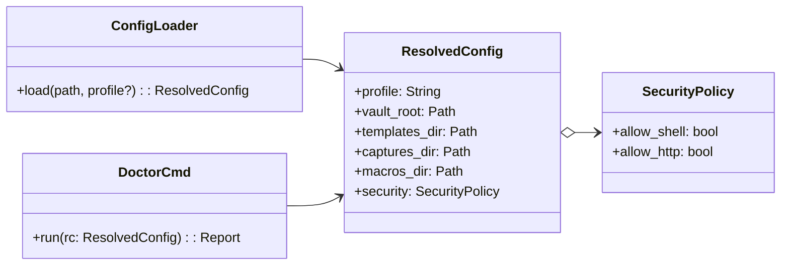

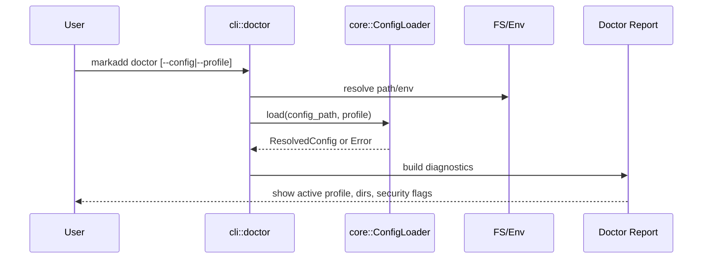

**Tests:** Missing/invalid path; profile not found; path expansion; XDG vs explicit path.  


---

## Phase 2 — Content specs (YAML/MD) + parsers

**Goals:** Parse template (MD+front-matter), capture (YAML), macro (YAML) with strict validation.

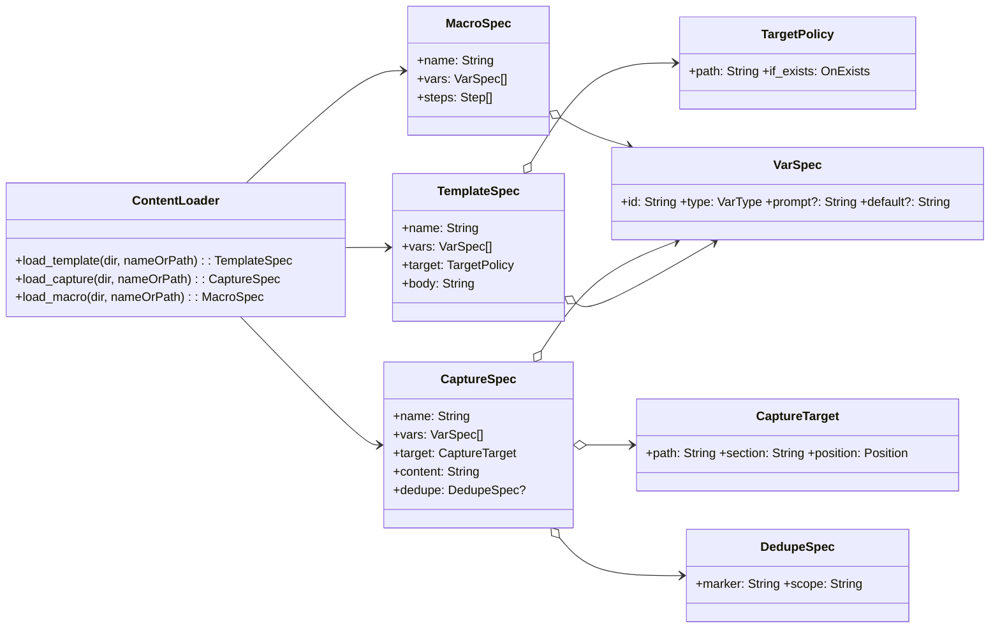

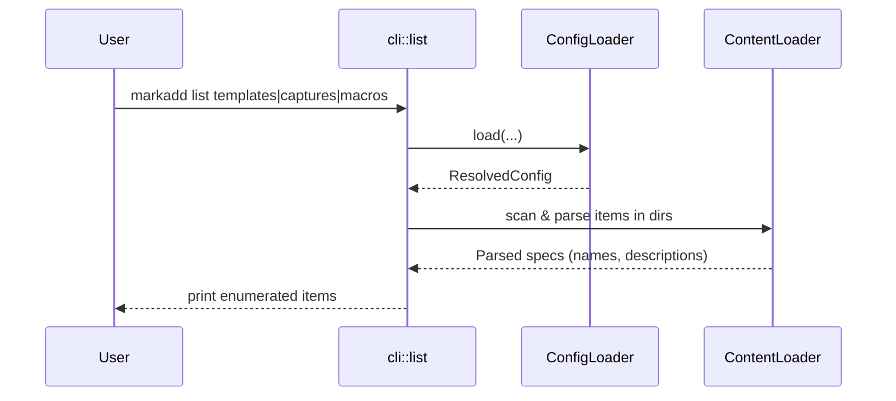

**Tests:** Unknown keys rejected; required fields enforced; helpful error spans.  


---

## Phase 3 — Variables & Providers + Template engine (Tera) + preview

**Goals:** Deterministic context resolution and rendering to strings.

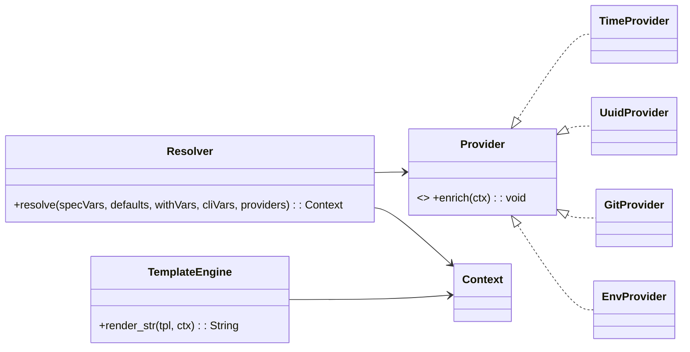

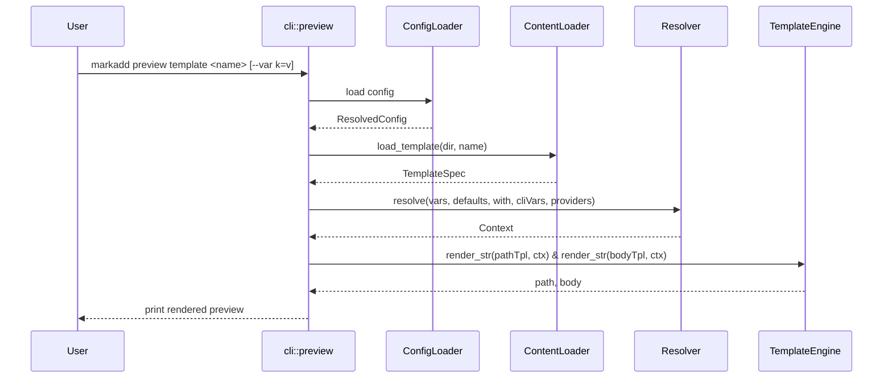

**Tests:** Enum/regex validation; date formatting; slugify; missing var error vs prompt (deferred to UI).  


---

## Phase 4 — Markdown AST edits (Comrak)

**Goals:** Reliable section insertion (begin/end) using an AST.

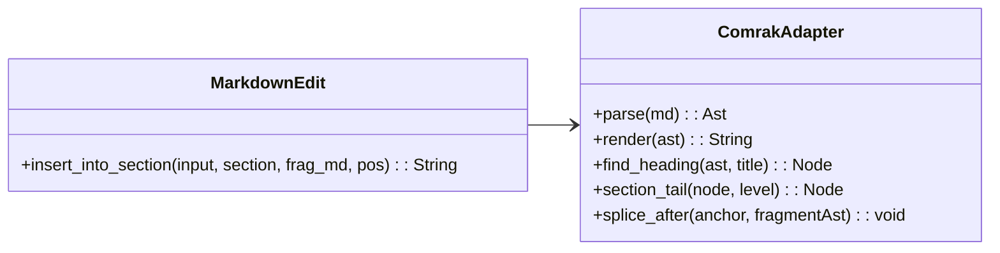

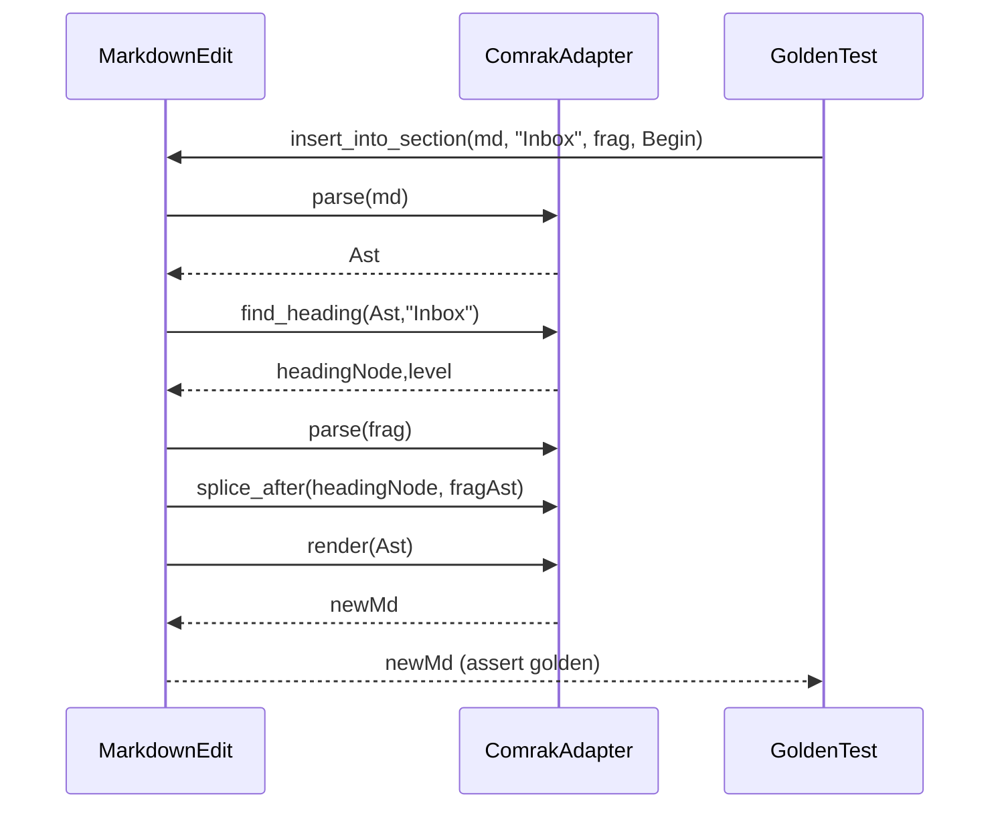

**Tests:** Empty section; last section; adjacency to code blocks/tables; Unicode headings.  


---

## Phase 5 — File planner & atomic writes (+ undo log)

**Goals:** Never corrupt notes; log changes for undo.

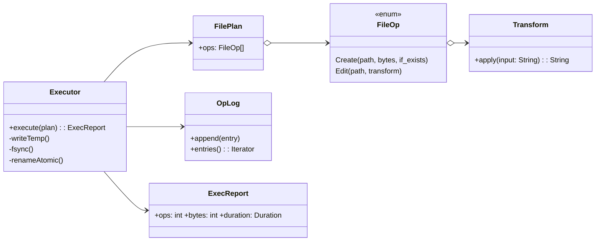

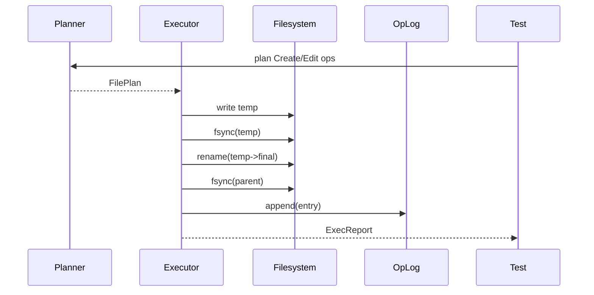

**Tests:** Crash-safety (simulated); if_exists policies; dedupe skip.  


---

## Phase 6 — Minimal CLI wiring

**Goals:** Usable commands: `template`, `capture`, `macro`, `list`, `preview`, `doctor`, `undo`.

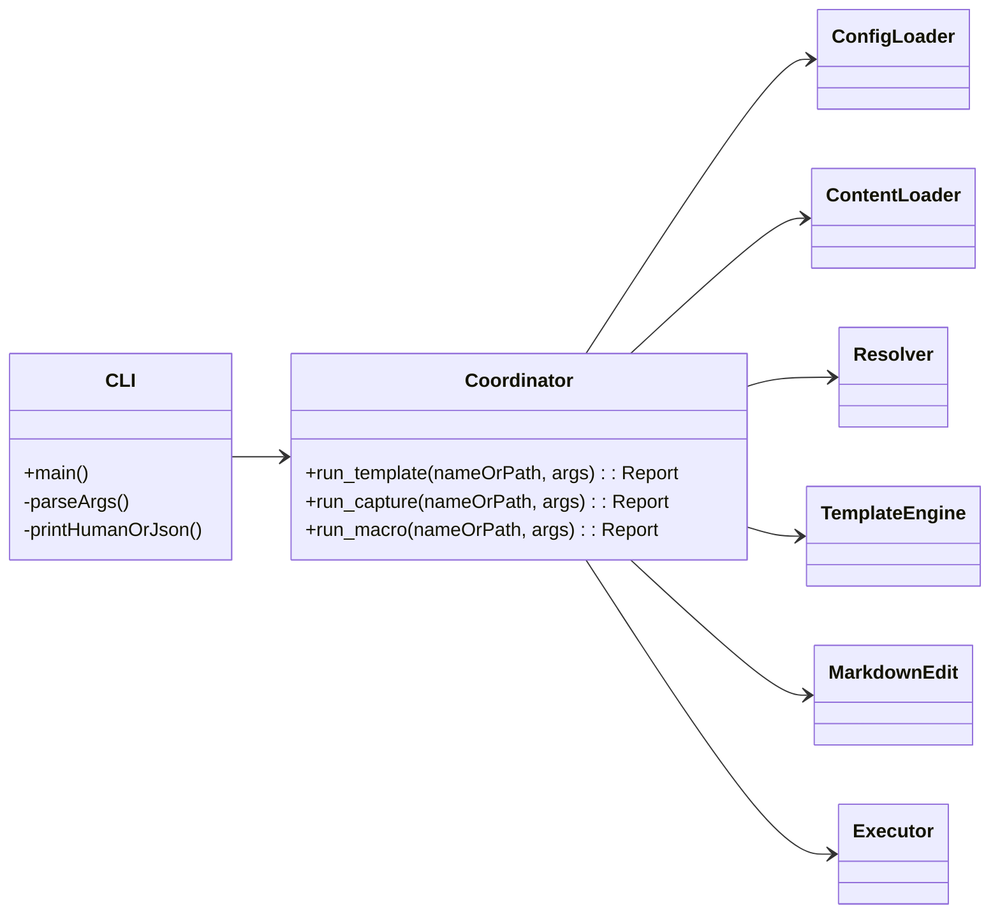

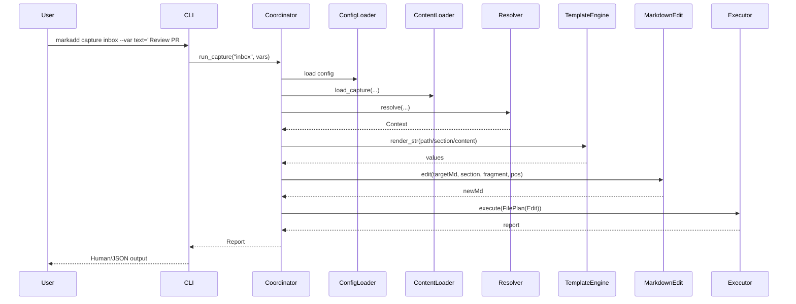

**Tests:** End-to-end happy paths; JSON output shape stability.  


---

## Phase 7 — Macro runner + Security gates

**Goals:** Compose steps with shared context; gate dangerous ops (`shell`, later HTTP).

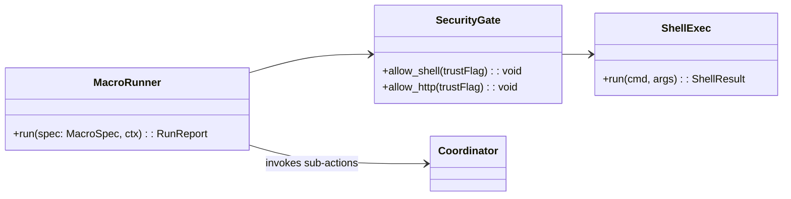

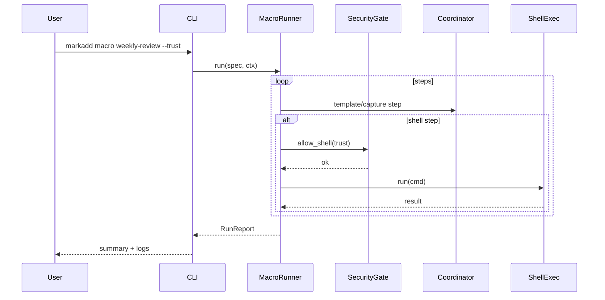

**Tests:** Abort vs continue; trust flag enforced; shell quoting.  


---

## Phase 8 — Lua hooks (optional)

**Goals:** Programmable captures/macros via sandboxed Lua API (escape hatch).

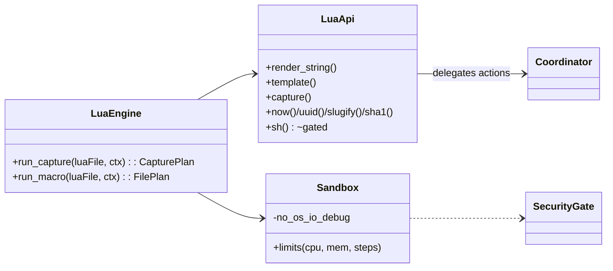

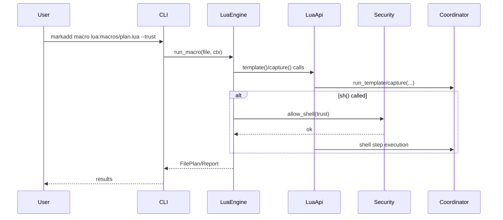

**Tests:** Sandbox disallows IO/OS; instruction/time limits; gated ops require trust.  


---

## Phase 9 — TUI (optional MVP)

**Goals:** Palette (fzf-like), previews, prompts; non-blocking engine.

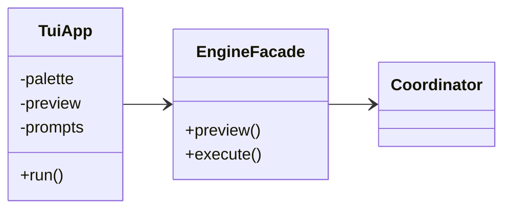

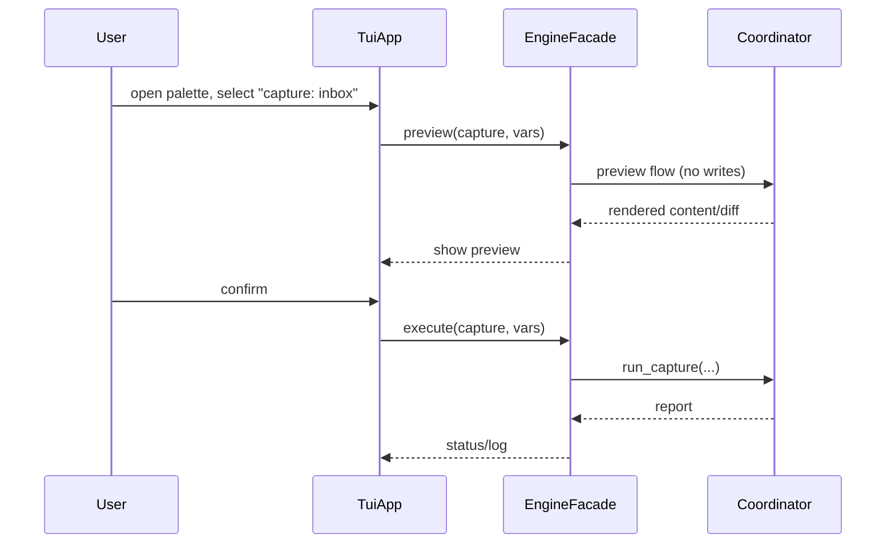

**Tests:** Headless snapshot tests; prompt validation; cancel flows.  


---

## Phase 10 — Docs, polish, release

**Goals:** User docs, binaries, packaging.

```mermaid
classDiagram
  direction LR
  class Docs {
    +UserGuide
    +AuthoringTemplates
    +SecurityModel
    +CLIReference
  }
  class Release {
    +binaries(macOS/Linux)
    +homebrew_tap
    +cargo_install
  }
  Docs ..> CLI
  Docs ..> Core
  Release ..> CI
```

```mermaid
sequenceDiagram
  participant Maint
  participant CI
  participant Release
  participant Users

  Maint->>CI: tag v0.1.0
  CI->>Release: build artifacts
  Release-->>Users: brew/cargo install paths
  Maint-->>Users: docs site updated
```

---

## Cross-cutting quality gates

- **Error taxonomy:** config/content/vars/template/markdown/io/security with context-rich messages.
- **Atomic writes:** temp→fsync→rename→fsync(parent).
- **Audit/undo:** JSONL operation log.
- **Benchmarks:** large-file capture stays sub-50ms typical.
- **Fuzzing:** AST inserter (edge Markdown).

---

## Immediate next Epics

1) **Config + Doctor + List** (Phases 1–2)  
2) **Variables + AST + Planner** (Phases 3–5) → yields working `template` and `capture`.


