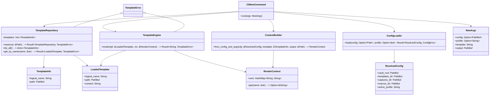
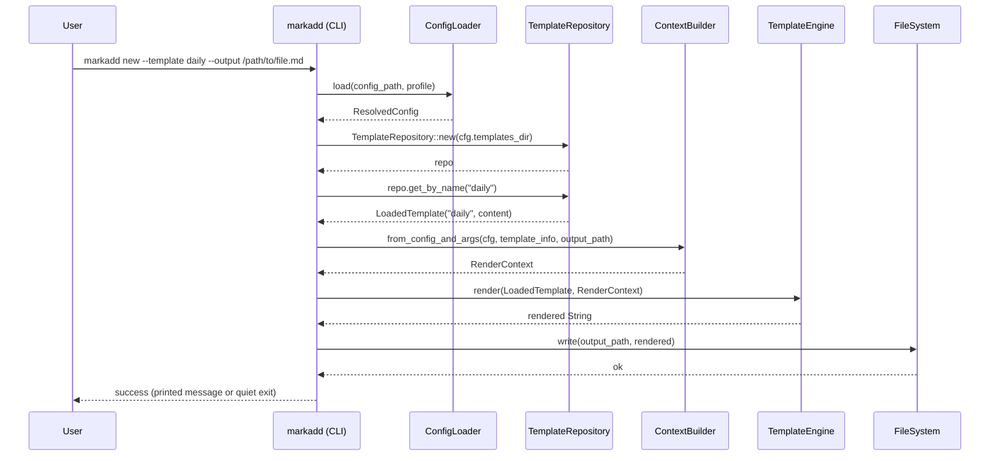

# Phase 03 — Architecture & UML  
## Template Engine MVP

Phase 03 introduces the **Template Engine MVP**: the first version of `markadd` that can actually *render* templates into output files, using the templates discovered in Phase 02 and the configuration system from Phase 01.

The aim of this phase is to add just enough structure to support:

- loading a template by **logical name**
- doing simple **variable substitution**
- writing the result to an **output path**
- exposing this via a new CLI command:
  - `markadd new --template <name> --output <path>`

This document describes the proposed architecture, modules, and responsibilities for Phase 03, along with UML diagrams.


## High-Level Design

### Key Ideas

1. The **template engine** should live in `markadd-core`, so it can be reused by CLI and later the TUI or macros.
2. It should build on the existing **discovery** module rather than re-scanning the filesystem itself.
3. It should be **minimal** but not a dead-end:
   - support a basic `{{var}}` syntax
   - provide a clear path to later support prompts, captures, and macros.


## Modules and Responsibilities

### 1. Template Model

We introduce a simple model for templates:

- `TemplateInfo` (already exists from Phase 02)
  - logical name
  - path

- `LoadedTemplate`
  - logical name
  - path
  - raw content (string)

This lives in `markadd-core` under:

- `crates/core/src/templates/model.rs` (or merged into `engine.rs` if you prefer fewer files)

### 2. Template Repository

A repository component that:

- discovers templates using `discover_templates()`
- indexes them by logical name
- loads a specific template’s content into memory

Responsibilities:

- cache the list of templates for performance (Phase 03 can keep it simple: in-memory per call)
- provide:
  - `list_all() -> Vec<TemplateInfo>`
  - `get_by_name(&str) -> Result<LoadedTemplate, TemplateError>`

### 3. Template Engine

The engine is responsible for:

- taking a `LoadedTemplate`
- taking a **context** (map of variable names → values)
- producing a rendered string

MVP behaviour:

- simple `{{name}}` substitution
- no control structures, no loops, no conditions
- undefined variables are either:
  - left as-is (`{{name}}`), or
  - replaced with an empty string  
  (we need to choose; leaving them visible is more debuggable for early phases).

Later phases can evolve this into:

- a small, custom template language or
- replacing the engine with an external templating crate.

### 4. Context Provider

Phase 03 needs at least some **built-in variables**. Proposed:

- `date` (e.g., `2025-11-13`)
- `time` (e.g., `19:32`)
- `datetime` (ISO)
- `vault_root`
- `template_name`
- `output_path`
- `output_filename`

Context provider responsibilities:

- derive context from:
  - config (from `ResolvedConfig`)
  - CLI parameters (template name, output path)
  - system clock (date/time)
- return a `HashMap<String, String>` as the render context


## New CLI Command: `markadd new`

CLI semantics:

- `markadd new --template <name> --output <path>`
- optional profile override and config path:
  - `--config <path>`
  - `--profile <name>`

Flow:

1. Parse CLI arguments via `clap`.
2. Load configuration and resolve profile (`ConfigLoader::load`).
3. Use `TemplateRepository` to:
   - find the requested logical template
   - load its content
4. Build a `RenderContext` from:
   - config
   - template info
   - output path
   - built-in date/time
5. Render via `TemplateEngine`.
6. Write the rendered content to the specified output file path.
7. Optionally: refuse to overwrite existing files unless a `--force` flag is added in a later phase.


## Proposed File Layout after Phase 03

At the end of Phase 03, the tree under `core` and `cli` might look like:

```
crates/core/src/templates/
discovery.rs
engine.rs
model.rs
mod.rs

crates/cli/src/cmd/
doctor.rs
list_templates.rs
new.rs
mod.rs
```


## UML — Class Diagram

Below is a Mermaid UML class diagram representing the main components of the template engine and their relationships.




## UML — Sequence Diagram (markadd new)

This sequence diagram shows the typical flow when executing:

```
markadd new --template daily --output /path/to/file.md
```




## Error Handling Strategy

Introduce a TemplateError enum in markadd-core for all template-related failures:

Examples:
- TemplateNotFound { name: String }
- IoError { source: std::io::Error }
- InvalidTemplateSyntax { path: PathBuf, details: String } (future)
- RenderError { details: String }

CLI layer maps these into human-readable messages and appropriate exit codes:
- TemplateNotFound → exit code 1, “template  not found”
- IoError → exit code 1, print OS error
- others → exit code 1 with a short description


## Testing Strategy

Core
- Unit tests for:
- TemplateRepository::get_by_name (found/404 cases)
- TemplateEngine::render simple substitution:
- single variable
- multiple variables
- undefined variable behaviour
- ContextBuilder correctness (vault_root, output_path, etc.)

CLI
- Integration tests for markadd new:
- successful creation with a simple template
- error when template does not exist
- error when output directory does not exist (or auto-create, if we choose that behaviour later)

We will also keep snapshot tests (insta) where CLI output has a stable format.


## Future Evolutions

This MVP architecture allows us to extend the engine without breaking the mental model:
- Add a PromptProvider that interacts with the user for missing variables.
- Add support for nested contexts and capture-based inserts.
- Add Lua or other scripting hooks around render events.
- Replace the simple substitution engine with a more powerful, yet controlled, templating backend if needed.


