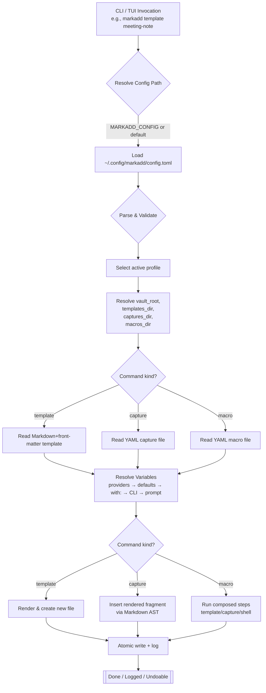

# markadd — Project Documentation


## 1. Overview

**markadd** is a terminal-first Markdown automation tool inspired by Obsidian’s QuickAdd plugin.  
It provides a console-native way to create, capture, and compose notes via templates, while remaining fully independent of Obsidian.  
It is designed to be **deterministic**, **safe**, and **extensible**—usable as a CLI or TUI, and embeddable in larger workflows.

Core operations:

- **Template:** create new Markdown files from templates that may contain variables.
- **Capture:** insert text or rendered fragments into existing Markdown files (at the beginning or end of a section).
- **Macro:** compose multiple template/capture (and optional shell) steps into scripted recipes.

Optional scripting layer: **Lua hooks** for advanced logic and looping, behind security gates.


## 2. Configuration model

### 2.1 Ground-truth configuration file

The single authoritative configuration file:

```
~/.config/markadd/config.toml
```

This TOML file defines where the **templates**, **captures**, and **macros** live, plus global runtime settings.

Example:

```toml
version = 1
profile = "default"

[profiles.default]
vault_root = "~/Documents/Obsidian/Vault"
templates_dir = "{{vault_root}}/.markadd/templates"
captures_dir  = "{{vault_root}}/.markadd/captures"
macros_dir    = "{{vault_root}}/.markadd/macros"

[profiles.work]
vault_root = "~/work/Notes"
templates_dir = "{{vault_root}}/.markadd/templates"
captures_dir  = "{{vault_root}}/.markadd/captures"
macros_dir    = "{{vault_root}}/.markadd/macros"

[security]
allow_shell = false
allow_http  = false
```

This config **only** contains markadd runtime settings (no variables or logic).


### 2.2 YAML content folders

User-authored files are stored within the directories specified in the config:

```
.markadd/
  templates/   → Markdown templates with YAML front-matter
  captures/    → YAML capture recipes
  macros/      → YAML macro definitions
```

#### Template (Markdown + YAML front-matter)

```markdown

name: meeting-note
description: Meeting notes template
vars:
  - id: title
    prompt: "Title"
    type: string
  - id: date
    prompt: "Date"
    type: date
    default: "{{ now | date('%Y-%m-%d') }}"
target:
  path: "notes/{{ date }}/{{ title | slugify }}.md"
  if_exists: append


# {{ title }}

**Date:** {{ date }}

## Agenda

- 

## Notes

- 
```

#### Capture (YAML)

```yaml
name: inbox
description: Add a checkbox to today's daily note
target:
  path: "Daily/{{ now | date('%Y-%m-%d') }}.md"
  section: "Inbox"
  position: begin
content: "- [ ] {{ text }}"
vars:
  - id: text
    prompt: "What to capture?"
    type: string
dedupe:
  marker: "{{ text | sha1 }}"
  scope: section
```

#### Macro (YAML)

```yaml
name: weekly-review
vars:
  - id: week
    prompt: "ISO week"
    type: string
steps:
  - template:
      use: "weekly-note.md"
      with:
        title: "Review {{ week }}"
        date: "{{ now | date('%Y-%m-%d') }}"
  - capture:
      use: "inbox"
      with:
        text: "Plan next week: {{ week }}"
  - shell:
      run: "git add . && git commit -m 'notes: weekly review {{ week }}'"
      on_error: continue
```


## 3. Config & content interaction diagram




## 4. Core architecture (crates and modules)

```
markadd/
  crates/
    core/
      config/        → load & validate config.toml
      content/       → parse YAML/MD files
      vars/          → resolve variables (providers + prompts)
      template/      → Tera-based rendering
      markdown_ast/  → Comrak insertion engine
      planner/       → atomic writes & undo log
      macro/         → macro runner
      security/      → trust gates (shell/http)
      lua/           → optional sandboxed Lua hooks
    cli/
      main.rs        → commands: template, capture, macro, list, preview, doctor, undo
    tui/
      (optional)
```

Each module exposes pure functions; CLI/TUI only handle I/O.


## 5. Command flows

### Template → New file
1. Load config.
2. Parse Markdown template.
3. Resolve variables.
4. Render path + body with Tera.
5. Plan → atomic create → log.

### Capture → Existing file
1. Load config.
2. Parse capture YAML.
3. Resolve variables.
4. Render target path, section, and fragment.
5. Modify target file using Markdown AST insertion.
6. Plan → atomic edit → log.

### Macro → Composed steps
1. Load macro YAML.
2. Resolve initial vars.
3. For each step:
   - Merge `with:` vars.
   - Execute sub-action (template/capture/shell).
   - Enforce security gates.
4. Log per step.


## 6. Lua hooks (optional)

Lua provides programmable captures/macros for advanced users.

### 6.1 Use cases
- Dynamic file selection
- Computed sections or looping macros
- Conditional captures

### 6.2 Host API (conceptual)
- Pure helpers: `api.now()`, `api.uuid()`, `api.slugify()`, `api.render_string()`
- Actions: `api.template{ use="template.md", with={...} }`
- Actions: `api.capture{ use="inbox.yaml", with={...} }`
- Gated (requires trust): `api.sh(cmd)`, `api.http.get(url)`

### 6.3 Security
- Disabled by default unless `[security.allow_shell]` or `[security.allow_http]` is true.
- Still requires `--trust` flag at runtime.
- Sandboxed via `mlua` safe mode; no filesystem or OS access.
- Resource limits (steps, timeout, memory).


## 7. Development plan (summary)

| Phase | Description | Deliverables |
|----|--------------|--------------|
| 0 | Repo bootstrap | crates layout, CI |
| 1 | Config loader | TOML parsing, `doctor` |
| 2 | Content parsers | YAML/MD parsing, validation |
| 3 | Variables & providers | context resolution, Tera |
| 4 | Markdown AST edits | Comrak insertion engine |
| 5 | File planner | atomic writes, undo log |
| 6 | CLI | commands + integration |
| 7 | Macros & security | macro runner, trust gates |
| 8 | Lua hooks | sandboxed scripting |
| 9 | TUI | fuzzy palette, preview |
| 10 | Docs & release | user docs, binaries |


## 8. Security and trust model

- Default: no shell or network operations.
- Config-controlled: `[security.allow_shell]`, `[security.allow_http]`.
- Runtime confirmation: user must pass `--trust`.
- Audit trail: every operation logged to `~/.config/markadd/.ops.jsonl`.


## 9. Extensibility & future plans

- **Template engine** pluggable (Tera now; Handlebars later).
- **Providers** system extensible via traits.
- **Macro steps**: new kinds (loop, condition, HTTP fetch).
- **Executor** abstraction: local FS → remote targets.
- **TUI** palette with real-time previews and prompts.
- **Scripting**: Lua today, maybe WASM later.


## 10. Testing and reliability

- Unit + golden tests for each module.
- Markdown AST tests for edge cases.
- Integration tests for `template` and `capture`.
- Property tests for atomic writes.
- Fuzzing on Markdown insertion.
- “Doctor” sanity checks for config correctness.


## 11. Design principles

1. **Deterministic:** predictable order of resolution, reproducible outputs.
2. **Atomic:** no partial writes.
3. **Composable:** CLI pipelines, TUI interactions, or API embedding.
4. **Secure by default:** nothing dangerous runs without explicit trust.
5. **Friendly for writers:** YAML and Markdown remain human-readable.
6. **Extensible for hackers:** Lua hooks and traits for custom providers.


